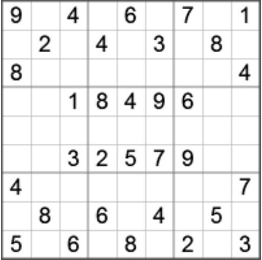

# Sudoku Validator
This is a Command Line tool (running on jvm) for validating a standard 9x9 Sudoku puzzle:

Command line: `validate.bat puzzleName.txt`

The program returns 0 (VALID) and -1 (INVALID) value with an error text on stdout (in case of an invalid solution or file).

File format: csv format each line representing a row e.g.:

    1,2,3,4,5,6,7,8,9
    1,2,3,4,5,6,7,8,9
    1,2,3,4,5,6,7,8,9
    1,2,3,4,5,6,7,8,9
    1,2,3,4,5,6,7,8,9
    1,2,3,4,5,6,7,8,9
    1,2,3,4,5,6,7,8,9
    1,2,3,4,5,6,7,8,9
    1,2,3,4,5,6,7,8,9

# Instructions to run the application

### Prerequisite software installed 

- Java version 11 or higher
- Maven
- Git

### Windows

1. Clone source code repository from GitHub found [here](https://github.com/saimirgasa/sudoku-validator).
2. Run `mvn clean install` from the source code root directory.
3. Place file `puzzleName.txt` with the sudoku solution in the root directory.
4. From the Command Line run `validate.bat puzzleName.txt`

### MacOS / Linux

1. Clone source code repository from GitHub found [here](https://github.com/saimirgasa/sudoku-validator).
2. Run `mvn clean install` from the source code root directory.
3. Place file `puzzleName.txt` with the sudoku solution in the root directory.
4. From the Command Line run `./validate.sh puzzleName.txt`

# Tests

After running the command `mvn clean install` from the command line a report of the test coverage can be found in `target/jacoco/site/index.html`.
